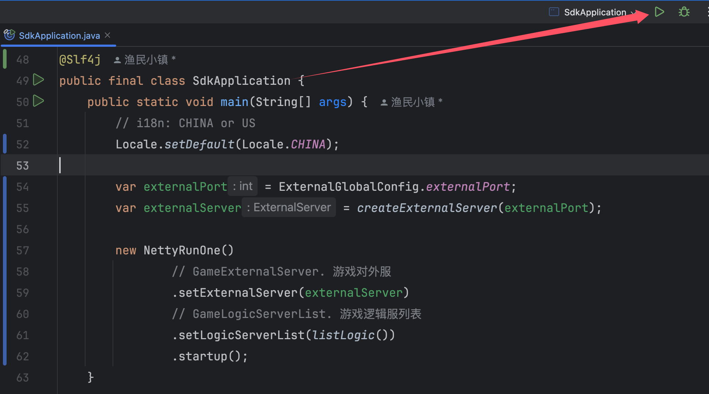

[中文](./README_CN.md)

## Introduction

Online document：https://www.yuque.com/iohao/game/irth38

ioGame Sdk Server Example.

[Sdk, Example, GenerateCode]，Client Examples 

1. [TypeScript CocosCreator](https://github.com/iohao/ioGame/issues/396)
2. [TypeScript Vue](https://github.com/iohao/ioGame/issues/397)
3. [TypeScript Html](https://github.com/iohao/ioGame/issues/398)
4. [C# Godot](https://github.com/iohao/ioGame/issues/399)
5. [C# Unity](https://github.com/iohao/ioGame/issues/400)

## Start up

> See SdkApplication.java ## SDK Server

## Generate code

> see GenerateTest.java ## Generate Code

### Action Java Code

Java Method (ioGame action)

1. Method description
2. Method Parameter description
3. Method ReturnValue description

### Generated TypeScript code

The client code will be generated based on the java code

ioGame generates two coding styles for each action:

1. code style: callback; Method names start with `of`.
2. code style: async await; Method names start with `ofAwait`.

**code style: callback** 

> hello action

> loginVerify action

**code style: async await** 

> hello action

> loginVerify action

### Generated C# code

The client code will be generated based on the java code.

ioGame generates two coding styles for each action:

1. code style: callback; Method names start with `Of`.
2. code style: async await; Method names start with `OfAwait`.

**code style: callback** 

> hello action

> loginVerify action

**code style: async await** 

> hello action

> loginVerify action

