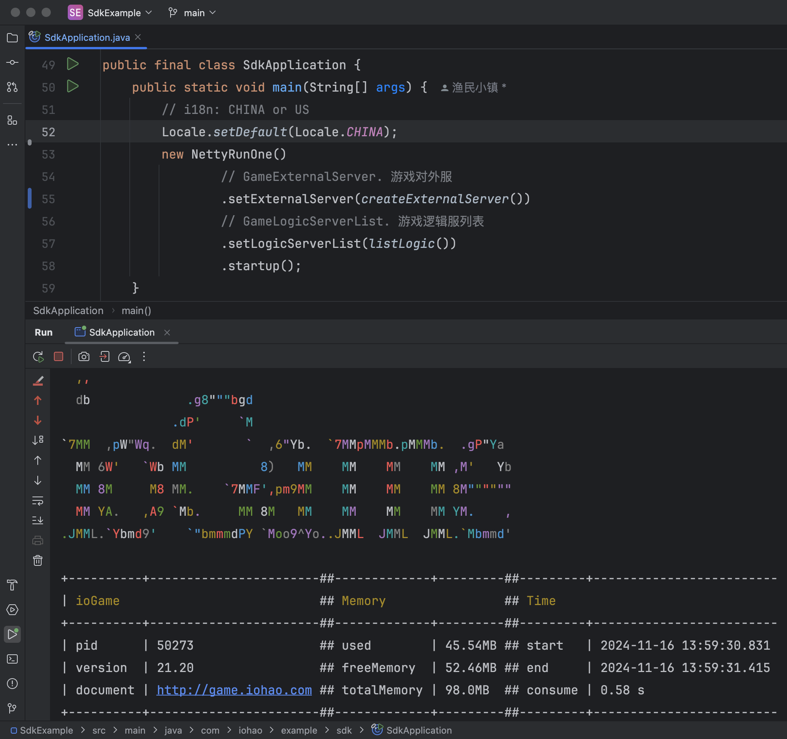
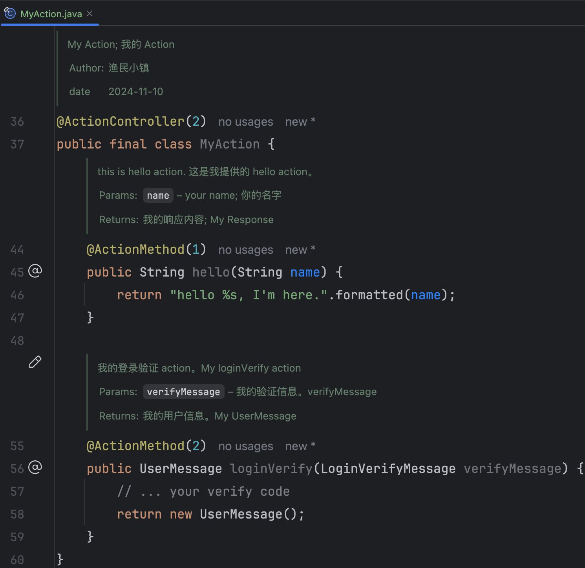
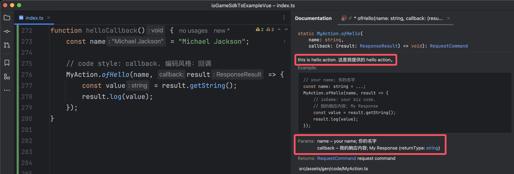
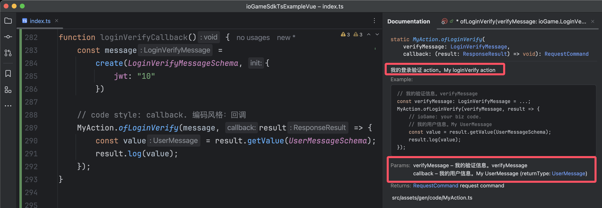
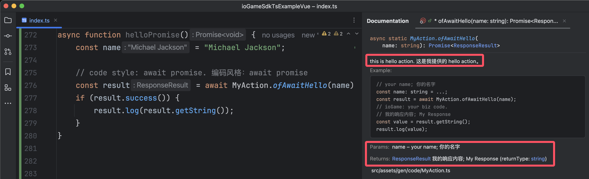
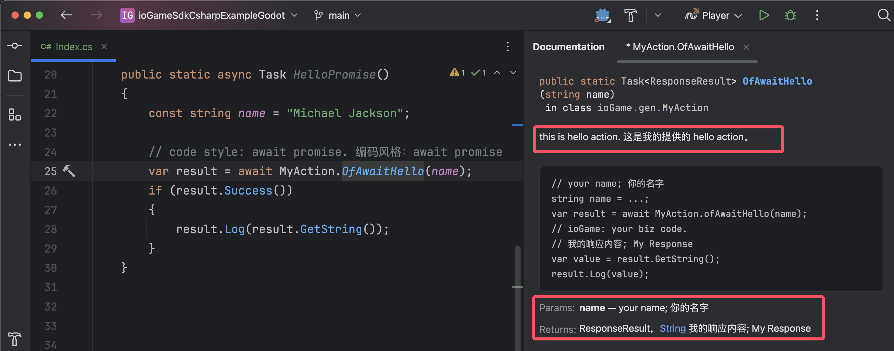

## 介绍

代码生成文档：https://iohao.github.io/game/docs/examples/code_generate


该项目是与 ioGame SDK（C# Sdk、Ts Sdk） 相关的联调演示，服务器提供了 `action、广播、错误码` 等相关内容用于交互演示。


**该项目主要演示 3 个方面的功能**

1. 与各种前端 SDK 的联调交互：`action、广播、错误码`，并展示了[协议碎片](https://iohao.github.io/game/docs/manual/protocol_fragment)及 List 的数据传输支持。
2. 心跳的处理。
3. 各 SDK 的对接代码生成： `action、广播、错误码` 交互代码生成。


**SDK 代码生成的几个优势**

1. 帮助客户端开发者减少巨大的工作量，**不需要编写大量的模板代码**。
2. **语义明确，清晰**。生成的交互代码即能明确所需要的参数类型，又能明确服务器是否会有返回值。这些会在生成接口时就提前明确好。
3. 由于我们可以做到明确交互接口，进而可以明确参数类型。这使得**接口方法参数类型安全、明确**，从而有效避免安全隐患，从而**减少联调时的低级错误**。
4. 减少服务器与客户端双方对接时的沟通成本，代码即文档。生成的联调代码中有文档与使用示例，方法上的示例会教你如何使用，即使是新手也能做到**零学习成本**。
5. 帮助客户端开发者屏蔽与服务器交互部分，**将更多的精力放在真正的业务上**。
6. 为双方联调减少心智负担。联调代码使用简单，**与本地方法调用一般丝滑**。
7. 抛弃传统面向协议对接的方式，转而使用**面向接口方法的对接方式**。
8. 当我们的 java 代码编写完成后，我们的文档及交互接口可做到同步更新，不需要额外花时间去维护对接文档及其内容。


## 启动服务器

> 运行 SdkApplication.java 启动游戏服务器




## 生成代码

运行 GenerateTest 后

1. 将会在 ./target/code 目录中生成与前端交互的文件。
2. 将会在 ./target/proto 目录中生成 .proto 文件。


## SDK 代码生成的使用场景

根据服务器所提供的 `action、广播、错误码`，自动生成前端客户端所需要的交互代码。目前提供了两种语言的支持，分别是 Csharp、TypeScript，其语言对应的游戏引擎有

| ioGame SDK                                           | 支持的游戏引擎                                               |
| ---------------------------------------------------- | ------------------------------------------------------------ |
| [C# SDK](https://github.com/iohao/ioGame/issues/205) | [Godot](https://godotengine.org/)、[Unity](https://unity.cn/) |
| [Ts SDK](https://github.com/iohao/ioGame/issues/204) | [Cocos Creator](https://www.cocos.com/)、[Laya](https://www.layabox.com/) |


Ts SDK 除了能用在游戏引擎外，还能用在各种现代的前端框架，如 [Vue](https://github.com/vuejs/)、[angular](https://github.com/angular) 等。简单的说，Ts SDK 适用于任意支持 TypeScript 的相关项目；同样，C# Sdk 适用于任意支持 C# 的相关项目。


假如现在你的服务器项目已经提供了数百个 action 方法，而前端引擎需要由 Ts 切换到 C# 语言相关的引擎；那么 ioGame 的代码生成将会派上巨大的用场，因为可以瞬间生成与前端交互所需的代码。这个操作将为前端节省巨大的工作量，同时也为沟通节省了巨大的成本。生成的交互 api 是直观的，如本地方法调用般丝滑。


此外，除了切换前端引擎的场景外，ioGame 还支持同时与不同的游戏引擎交互，因为无论生成哪种语言的交互 api，在使用的感观上几乎是一致的。


> 其他案例：当我们在开发个人项目时，在没能找到前端可合作的开发者时，依然可以先编写游戏服务器相关的代码，将来如果遇见合适的合作人员时，就可以通过代码生成将已有的 action 生成一份给到前端哥们。


## 前端示例项目

以下这些 demo 已经与本项目调通，前端代码`action、广播、错误码` 等，由 ioGame 生成。前端开发者在通信的交互上本地方法调用一般丝滑，让前端开发者将更多的精力放在真正的业务，而不是编写这些模板式的交互代码上。

| Github                                                       | 描述                                                         |
| ------------------------------------------------------------ | ------------------------------------------------------------ |
| [ioGameSdkC#ExampleGodot](https://github.com/iohao/ioGameSdkCsharpExampleGodot) | 与 [Godot](https://godotengine.org/) 互通的一个示例。 Godot、Protobuf、Netty、ioGame、C#、Csharp、WebSocket |
| [ioGameSdkC#ExampleUnity](https://github.com/iohao/ioGameSdkCsharpExampleUnity) | 与 [Unity](https://unity.com/) 互通的一个示例。 Unity、Protobuf、Netty、ioGame、C#、Csharp、WebSocket |
| [ioGameSdkTsExampleCocos](https://github.com/iohao/ioGameSdkTsExampleCocos) | 与 [Cocos Creator](https://www.cocos.com/) 互通的一个示例。 CocosCreator、Protobuf、Netty、ioGame、TypeScript、WebSocket |
| [ioGameSdkTsExampleVue](https://github.com/iohao/ioGameSdkTsExampleVue) | 与 [Vue](https://github.com/vuejs/) 互通的一个示例。 Vue、Protobuf、Netty、ioGame、TypeScript、WebSocket |
| [ioGameSdkTsExampleAngular](https://github.com/iohao/ioGameSdkTsExampleAngular) | 与 [Angular](https://github.com/angular/angular) 互通的一个示例。 Angular、Protobuf、Netty、ioGame、TypeScript、WebSocket |
| [ioGameSdkTsExampleHtml](https://github.com/iohao/ioGameSdkTsExampleHtml) | 与 [webpack](https://github.com/webpack/webpack) 互通的一个示例。 （webpack: html + ts）、Protobuf、Netty、ioGame、TypeScript、WebSocket |

---


## 一次编写，到处对接；提升巨大的生产力；

ioGame 能为各种前端生成 `action、广播、错误码` 相关代码。这将意味着，你只需要编写一次业务代码，就可以同时与这些游戏引擎或现代化的前端框架交互。


**一次编写**指的是编写一次 java 业务代码，而**到处对接**则是指为不同的前端项目生成与服务器交互的代码。


### Action Java Code

让我们先看一段 java 代码，这段代码我们只需要关注类上的注释及 action 方法上的注释。


我们为 action 方法提供了一些描述，分别是

1. 方法描述
2. 参数的描述
3. 返回值的描述




### 生成的 TypeScript 代码，演示说明

根据 MyAction.java 生成 Ts 对应的代码如下

1. 生成了方法描述
2. 生成了方法参数类型及其描述
3. 生成了方法返回值类型及其描述
4. 更重要的是生成了相关的使用示例，方法上的示例会教你如何使用，即使是新手也能做到零学习本。


ioGame 会为每个 action 生成两种编码风格的方法，分别是

1. code style: callback 回调风格，方法名以 of 打头。**优点：简洁，一体化**。
2. code style: async await，方法名以 ofAwait 打头。**优点：可避免回调地狱**。


**两种风格该如何选择？**

两个编码风格在本质上没有太大差别，简单业务选择 callback、复杂业务建议使用 async await。这里的复杂指的是你需要在回调中继续请求游戏服务器，这样就可能产生回调地狱，而 async await 编码风格可以很好的避免此问题。


**code style: callback** 

图中是 `code style: callback. 编码风格：回调风格`的演示，**优点：简洁，一体化**。

> hello action




> loginVerify action




**code style: async await** 

下图是 `code style: async await. 编码风格：async await 风格`的演示，**优点：可避免回调地狱**。

> **注意**看方法中的使用示例，ioGame 会根据不同编码风格生成对应的使用示例。


> hello action




> loginVerify action


### 生成的 C# 代码，演示说明

根据 MyAction.java 生成 C# 对应的代码如下

1. 生成了方法描述
2. 生成了方法参数类型及其描述
3. 生成了方法返回值类型及其描述
4. 更重要的是生成了相关的使用示例，方法上的示例会教你如何使用，即使是新手也能做到零学习本。


ioGame 会为每个 action 生成两种编码风格的方法，分别是

1. code style: callback 回调风格，方法名以 Of 打头。**优点：简洁，一体化**。
2. code style: async await，方法名以 OfAwait 打头。**优点：可避免回调地狱**。


**两种风格该如何选择？**

两个编码风格在本质上没有太大差别，简单业务选择 callback、复杂业务建议使用 async await。这里的复杂指的是你需要在回调中继续请求游戏服务器，这样就可能产生回调地狱，而 async await 编码风格可以很好的避免此问题。


**code style: callback** 

图中是 `code style: callback. 编码风格：回调风格`的演示，**优点：简洁，一体化**。

> hello action


> loginVerify action


**code style: async await** 

下图是 `code style: async await. 编码风格：async await 风格`的演示，**优点：可避免回调地狱**。

> 注意看方法中的使用示例，ioGame 会根据不同编码风格生成对应的使用示例。

> hello action



> loginVerify action


### 小结

现在我们知道了一次编写，到处对接的威力了。我们只需要编写一份 java 代码就能生成各客户端的对接交互代码，为前端开发者减少了巨大的工作量，生成的交互 api 是直观的，如本地方法调用般丝滑。


代码生成可以让开发者专注于业务逻辑，而不是文档编写。它也可以提高团队协作的效率和质量，保证文档的同步和准确。如果没有游戏文档的生成，那么你将要抽出一些时间来编写、维护对接文档的工作，而且当团队人数多了之后，文档就会很乱、不同步、不是最新的、忘记更新等情况就会出现。


ioGame 让我们做到了 java 方法注释即文档，action 代码即对接。当你的代码编写完后，对应的文档及交互代码也就完成了。这样就不需要额外的花时间去编写和维护文档了，可以节省更多的时间。


ioGame 会为每个 action 生成两种编码风格的方法，分别是

1. code style: callback 回调风格，方法名以 of 打头。**优点：简洁，一体化**。
2. code style: async await，方法名以 ofAwait 打头。**优点：可避免回调地狱**。


## 如何生成 SDK 交互代码


关于代码生成，可阅读 `GenerateTest.java`


ioGame 生成各 SDK 的交互代码是简单，通常有以下几个步骤

1. 加载需要生成代码的游戏逻辑服（业务逻辑服），用于生成 xxxAction。
2. 添加需要生成的交互语言 `generateCocosXXX`
3. 添加错误码：`addErrorCodeClass`，用于生成错误码
4. 生成 .proto 协议：`generateProtoFile`，用于生成 .proto 文件。


现在，我们只需要关注 `generateCodeXXX` 开头的方法；虽然下面的代码中给出了多个 `generateCodeXXX` 的代码生成，但在实现开发中，我们通常只需要生成其中一种，其交互代码默认将会生成到当前项目的  `target/code` 目录中。


目前我们只提供了 Ts 和 C# 的生成实现

1. Ts 代码的生成 `TypeScriptDocumentGenerate`
2. C# 代码的生成 `CSharpDocumentGenerate`


> 下一小节会对每一个 `generateCodeXXX` 做详细的说明。

```java
public final class GenerateTest {
    ... 省略部分代码
    public static void main(String[] args) {
        // CHINA or US
        Locale.setDefault(Locale.CHINA);

        // Load the business framework of each gameLogicServer
        // 加载业务逻辑服
        SdkApplication.listLogic().forEach(BrokerClientStartup::createBarSkeleton);
        
        /*
         * GameExternalServer accessAuthentication
         * 游戏对外服访问权限，不生成权限控制的 action
         */
        SdkApplication.extractedAccess();
        DocumentAccessAuthentication reject = ExternalGlobalConfig.accessAuthenticationHook::reject;
        IoGameDocumentHelper.setDocumentAccessAuthentication(reject);
        
        /*
         * Generate actions, broadcasts, and error codes.
         * cn: 生成 action、广播、错误码
         */
        
        // About generating TypeScript code。
        // generateCodeVue();
        // generateCodeHtml();
        // generateCocosCreator();
        
        // About generating C# code
        // generateCodeCsharpGodot();
        // generateCodeCsharpUnity();
       
        // Added an enumeration error code class to generate error code related information
        IoGameDocumentHelper.addErrorCodeClass(SdkGameCodeEnum.class);
        // Generate document；
        IoGameDocumentHelper.generateDocument();
        // Generate .proto
        generateProtoFile();
    }
    
    static void generateProtoFile() {
        /*
         * .proto generate
         * document https://iohao.github.io/game/docs/extension_module/jprotobuf
         */

        // By default, it will be generated in the target/proto directory
        // .proto 默认生成的目录为 target/proto

        // The package name to be scanned
        String packagePath = "com.iohao.example.sdk.data";
        GenerateFileKit.generate(packagePath);
    }
}
```


### Generate TypeScript

`generateCodeVue()`、`generateCodeHtml()`、`generateCocosCreator()` 都是通过 `TypeScriptDocumentGenerate` 类生成的。


使用 `TypeScriptDocumentGenerate` 类有两个需要注意的方法，分别是

1. `setPath`：当不做任何设置时，代码将会生成在 `target/code` 目录中，如果有需要可以指定生成的路径。
2. `setProtoImportPath`，这个是 .proto 的导入路径。因为 cocosCreator 比较特殊，需要使用 `db://` 开头的地址导入资源，而 Vue 使用相对路径即可导入。


举例说明 `setProtoImportPath`：即使 CocosCreator、Vue 使用相同的目录结构；CocosCreator 需要使用 `db://` 开头的地址导入 `common_pb.ts` 协议文件，而 Vue 使用相对路径即可。

```text
.
├── code
│   ├── GameCode.ts
│   ├── Listener.ts
│   ├── MyAction.ts
│   └── SdkAction.ts
└── common_pb.ts
```


```java
public final class GenerateTest {
    ... 省略部分代码
    public static void main(String[] args) {
        ... 省略部分代码

        /*
         * Generate actions, broadcasts, and error codes.
         * cn: 生成 action、广播、错误码
         */
        
        // About generating TypeScript code
        generateCodeVue();
        enerateCodeHtml();
        generateCocosCreator();
        
        ... 省略部分代码
    }
    
	private static void generateCodeVue() {
        var documentGenerate = new TypeScriptDocumentGenerate();

        // 设置代码生成所存放的路径，如果不做任何设置，将会生成在 target/code 目录中
        // By default, it will be generated in the target/code directory
        String path = "/Users/join/gitme/ioGame-sdk/ioGameSdkTsExampleVue/src/assets/gen/code";
        documentGenerate.setPath(path);

        // Your .proto path: Set the import path of common_pb in Vue.
        documentGenerate.setProtoImportPath("../common_pb");

        IoGameDocumentHelper.addDocumentGenerate(documentGenerate);
    }

    private static void generateCodeHtml() {
        var documentGenerate = new TypeScriptDocumentGenerate();

        // 设置代码生成所存放的路径，如果不做任何设置，将会生成在 target/code 目录中
        // By default, it will be generated in the   target/code directory
        String path = "/Users/join/gitme/ioGame-sdk/ioGameSdkTsExampleHtml/src/assets/gen/code";
        documentGenerate.setPath(path);

        // Your .proto path: Set the import path of common_pb in Vue.
        documentGenerate.setProtoImportPath("../common_pb");

        IoGameDocumentHelper.addDocumentGenerate(documentGenerate);
    }

    private static void generateCocosCreator() {
        var documentGenerate = new TypeScriptDocumentGenerate();

        // 设置代码生成所存放的路径，如果不做任何设置，将会生成在   target/code 目录中
        // By default, it will be generated in the   target/code directory
        String path = "/Users/join/gitme/ioGame-sdk/ioGameSdkTsExampleCocos/assets/scripts/gen/code";
        documentGenerate.setPath(path);

        // Your .proto path: Set the import path of common_pb in CocosCreator
        documentGenerate.setProtoImportPath("db://assets/scripts/gen/common_pb");

        IoGameDocumentHelper.addDocumentGenerate(documentGenerate);
    }
}
```


### Generate C#

`generateCodeCsharpUnity()`、`generateCodeCsharpGodot()` 都是通过 `CSharpDocumentGenerate` 类生成的。


使用 `CSharpDocumentGenerate` 类有一个需要注意的方法

1. `setPath`：当不做任何设置时，代码将会生成在 `target/code` 目录中，如果有需要可以指定生成的路径。
2. `setProtoImportPath`，这个是 .proto 的导入路径，使用 .proto package 名。如果不做任何设置，默认值是 `using Pb.Common;`。


以下示例中，Unity 与 Godot 在代码生成的使用上是一样的。

```java
public final class GenerateTest {
    ... 省略部分代码
    public static void main(String[] args) {
        ... 省略部分代码

        /*
         * Generate actions, broadcasts, and error codes.
         * cn: 生成 action、广播、错误码
         */
        
        // About generating C# code
        generateCodeCsharpUnity();
        generateCodeCsharpGodot();
        
        ... 省略部分代码
    }
    
	private static void generateCodeCsharpUnity() {
        CSharpDocumentGenerate documentGenerate = new CSharpDocumentGenerate();
        // 设置代码生成所存放的路径，如果不做任何设置，将会生成在 target/code 目录中
        // By default, it will be generated in the target/code directory
        String path = "/Users/join/gitme/ioGame-sdk/ioGameSdkCsharpExampleUnity/Assets/Scripts/Gen/Code";
        documentGenerate.setPath(path);
        
        // Your .proto path: Set the import path of common_pb in C#
        // see target/proto/common.proto package
        // documentGenerate.setProtoImportPath("using Pb.Common;");

        IoGameDocumentHelper.addDocumentGenerate(documentGenerate);
    }

    private static void generateCodeCsharpGodot() {
        CSharpDocumentGenerate documentGenerate = new CSharpDocumentGenerate();
        // 设置代码生成所存放的路径，如果不做任何设置，将会生成在 target/code 目录中
        // By default, it will be generated in the target/code directory
        String path = "/Users/join/gitme/ioGame-sdk/ioGameSdkCsharpExampleGodot/script/gen/code";
        documentGenerate.setPath(path);
        
        // Your .proto path: Set the import path of common_pb in C#
        // see target/proto/common.proto package
        // documentGenerate.setProtoImportPath("using Pb.Common;");

        IoGameDocumentHelper.addDocumentGenerate(documentGenerate);
    }
}
```


### 广播代码

TypeScript、C# 生成广播相关的代码文件统一命名为 `Listener`，如 `Listener.cs、Listener.ts`。Listener 文件中包含了服务器所有主动的广播动作，通常来说我们只需要在广播监听回调中编写自己的业务逻辑即可，如下


```c#
// C#
Listener.ListenBulletBroadcast(result =>
{
    var bulletMessage = result.GetValue<BulletMessage>();
    result.Log(bulletMessage);
});

// 特殊方法，默认的监听动作，这是由 ioGame 生成的方法。
// 该方法为所有广播监听添加了打印的行为，目的是让开发者知道有哪些广播方法没有处理
Listener.Listener_ioGame();
```


```typescript
// Ts
Listener.listenBulletBroadcast(result => {
    const bullet = result.getValue(BulletMessageSchema);
    result.log(bullet);
})

// 特殊方法，默认的监听动作，这是由 ioGame 生成的方法。
// 该方法为所有广播监听添加了打印的行为，目的是让开发者知道有哪些广播方法没有处理
Listener.listener_ioGame();
```


### 错误码

错误码相关的代码文件统一命名为 `GameCode`，在触发错误时，服务器会将错误码放到 result responseStatus 字段中。


以下展示了两种编码风格关于错误的处理

```c#
public static async Task OnTestError()
{    
    var value = _testErrorValue++;
    Log("------- OnTestError ------");

    // code style: callback.
    SdkAction.OfTestError(value, result =>
    {
        result.Log(result.GetInt());
    }).OnError(result =>
    {
        // error
        result.Log(result.GetErrorInfo());
        // result.GetResponseStatus()
    });

    // code style: await promise.
    var result = await SdkAction.OfAwaitTestError(value);
    // result.GetResponseStatus()
    if (result.Success())
        result.Log(result.GetInt());
    else
        result.Log(result.GetErrorInfo());
}
```


## 注意事项

默认情况下，生成的 action 交互代码的方法名使用的是 java action 的方法名。如果你的 java action 方法名有变动，则会影响客户端的代码。


为了避免此类情况，有两种方式

1. 不要更改已经发布的 action 方法名。
2. 给 action 添加 `DocumentMethod` 注解来固定方法名。ioGame 在生成对接代码时，会优先使用 `DocumentMethod` 注解的值。

```java
@ActionController(SdkCmd.cmd)
public final class SdkAction {    
    @ActionMethod(SdkCmd.loginVerify)
    @DocumentMethod("loginVerifyName")
    public UserMessage loginVerify(LoginVerifyMessage verifyMessage) {
        ...
    }
}
```


通常情况下，如果你没有经常更改 action 方法名的习惯，可以不需要使用 `DocumentMethod` 注解，因为这可以让你的代码保持简洁。


但无论如何你都要记住，不要更改已经发布的方法名，因为这会让前端开发者产生不必要的小情绪。

