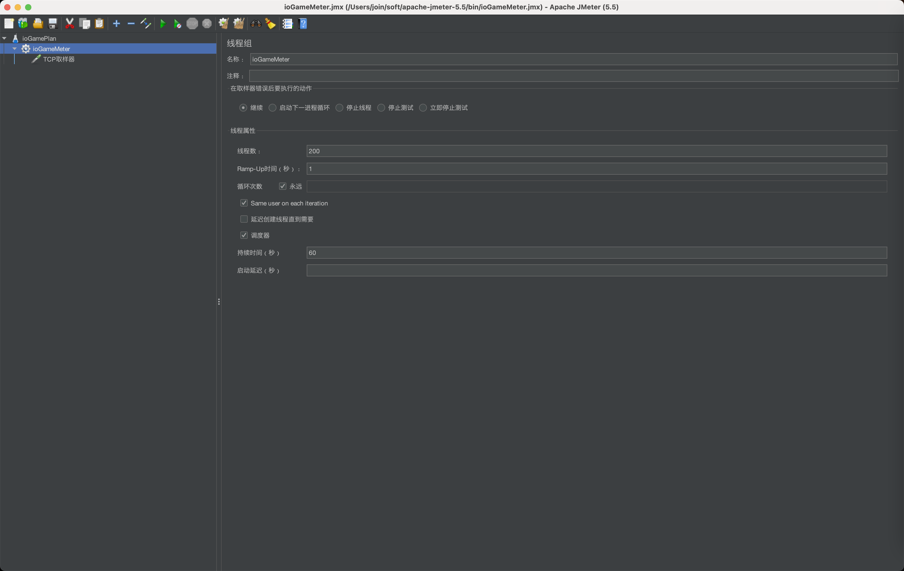

### 启动类

> MeterTcpSocketApplication.java

> TestExternalCodec.java 生成十六进制参考类 （如有需要可以查看）

### jmeter
在 doc 目录中有 ioGameMeter.jmx 配置文件；

启动 jmeter 后，打开 ioGameMeter.jmx 就可以启动测试了；

文件配置了 200 线程不停的发送消息，持续 60 秒；

jmeter 下载地址 https://jmeter.apache.org/download_jmeter.cgi

### 测试流程步骤

**1 将模块 example-meter 打成 jar 包**
> 在示例根目录执行 mvnd package 后
> 
> 在 example/example-meter/target 目录下生成 example-meter-3.0.0.io-jar-with-dependencies.jar
> 

**2 启动 jar**
> java -jar example-meter-3.0.0.io-jar-with-dependencies.jar

**3 启动 jmeter**

这个命令是不会启动 jmeter 的 GUI 界面的，启动参数需要根据你当前使用的系统做些调整。

当执行命令后，会在指定的路径生成 html 格式的数据
> sh jmeter -n -t ioGameMeter.jmx -l "ioGameMeterPlan.log" -e -o /Users/join/gitme/meter

**jmeter 启动注意事项**
1. 确保 "ioGameMeterPlan.log" 文件不存在
2. 确保 /Users/join/gitme/meter 目录不存在
3. ioGameMeter.jmx 路径需要正确，上述命令执行时，已将文件移动到 jmeter 的 bin 目录中了