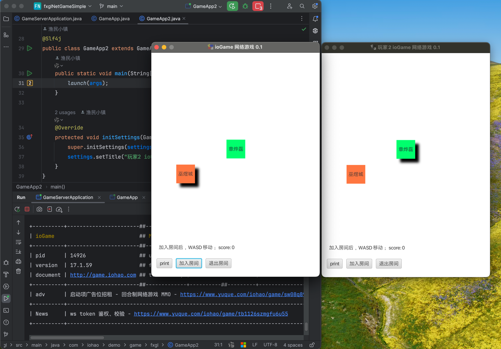

## 简介

https://iohao.github.io/game/docs/examples/client/example_fxgl_move

FXGL + ioGame 网络游戏中的多人移动演示

 

## 启动

1. GameServerApplication 先启动服务器
2. GameApp 启动游戏界面 1
3. GameApp2 启动游戏界面 2

加入房间后，按键 WASD 可移动自己。

## 游戏界面预览

